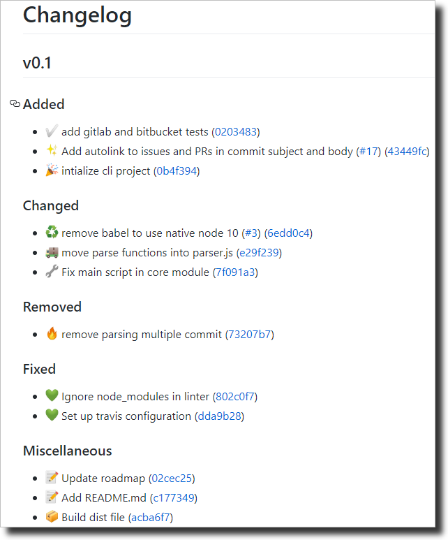

# gitmoji-changelog

## Description

This library generates changelog for repositories using [gitmoji](https://gitmoji.carloscuesta.me/) commits convention.

## Setup

Install the lib:

```bash
git clone git@github.com:frinyvonnick/gitmoji-changelog.git
cd gitmoji-changelog && yarn
```

## Usage

**Prerequisites:**
- use [gitmoji](https://gitmoji.carloscuesta.me/) for commits convention
- use [semver](https://semver.org/) for versions convention

**Workflow:**
1. Make changes and commit
  ```
  git commit . -m ":sparkles: my awesome feature"
  ```
2. Bump version in package.json
3. Run `gitmoji-changelog`, the file `changelog.md` is created or updated with the summary of all changes in the release. See the example below.
4. Commit `package.json` and `changelog` files
5. Tag and push

### CLI

```bash
node ../[path-to-gitmoji-changelog-folder]/packages/gitmoji-changelog-cli/src/index.js
```

### API

**// TODO**

## Mapping

When a commit is done with a gitmoji, the following mapping is used to group them : 

| Categorie | Gitmoji |
|---|---|
| Added | :sparkles: :tada: :white_check_mark: :bookmark: :construction_worker: :chart_with_upwards_trend: :heavy_plus_sign: :loud_sound: |
| Changed | :art: :zap: :lipstick: :rotating_light: :arrow_down: :arrow_up: :pushpin: :recycle: :wrench: :rewind: :alien: :truck: :boom: :bento: :wheelchair: :speech_balloon: :card_file_box: :children_crossing: :building_construction: :iphone: |
| Removed | :fire: :heavy_minus_sign: :mute: |
| Fixed | :bug: :ambulance: :apple: :penguin: :checkered_flag: :robot: :green_apple: :green_heart: :pencil2: |
| Security | :lock: |


> See [mapping.js](packages/gitmoji-changelog-core/src/mapping.js) for more details


## Example

Here is an example of the produced `changelog.md` produced : 




## Roadmap

### MVP

**Core:**
- [x] Transform raw commits in json structure
- [x] Write changelog file
- [x] Generate changelog for the next release
- [x] Add templating system for changelog in markdown (#7)
- [ ] Sort commits by emojis type and date (order defined in mapping file) (#12)
- [x] Add tag's date on version
- [ ] Handle incremental writing of changelog files (#23)

**Templating:**
- [x] Group commits by changelog types (#2)
- [x] Support Github commit links
- [x] Support Bitbucket, Gitlab, ... commit links

### Coming next

- [ ] CLI options (output file, from, to)
- [ ] Improve markdown template: keep tags hierarchy (semver)
- [ ] Add a middleware system to custom commits organization (#6)
- [ ] Generate Github release with changelog
- [ ] Generate Bitbucket, Gitlab, ... release with changelog
- [ ] Manage monorepo (package.json path option in cli)
- [ ] Manage scope (middleware ?) (#6)
- [ ] Generate other file formats (ASCIIdoc...)
